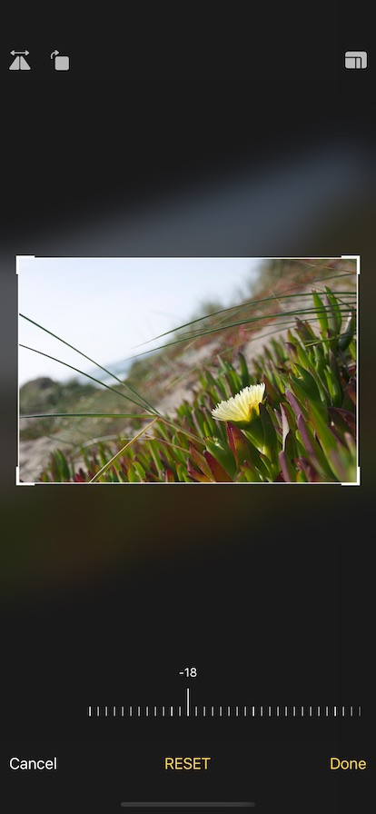

# QCropper

[](https://travis-ci.org/qchenqizhi/QCropper)
[](https://cocoapods.org/pods/QCropper)
[](https://cocoapods.org/pods/QCropper)
[](https://cocoapods.org/pods/QCropper)

This project aims to provide an image cropping experience like iOS Photos.app

I wrote the Objective-C version of QCropper for my company a few years ago, based on earlier versions of [TOCropViewController](https://github.com/TimOliver/TOCropViewController) and [PhotoTweaks](https://github.com/itouch2/PhotoTweaks). Now I am going to say goodbye to UIKit in advance, so I (as a newbee to the open source community) created this Swift version and let it open source

## Preview


#### Customization


## Features
- Image cropping
- Image rotating
- Image straightening
- Image flipping
- Select and lock aspect ratio 
- Save and restore state, reset/re-edit

## Todo
- [ ] Documention
- [ ] Unit Tests
- [ ] Localization
- [x] CocoaPods
- [ ] Carthage/SPM
- [ ] SwiftUI version
- [ ] Landscape/iPad
- [ ] Custom transtion
- [x] Angle ruler
- [x] Aspect ratio picker
- [x] Circular
- [x] Overlays & CustomUI customization

## Installation

QCropper is available through [CocoaPods](https://cocoapods.org). To install
it, simply add the following line to your Podfile:

```ruby
pod 'QCropper'
```

## License
QCropper is available under the MIT license. See the [LICENSE](LICENSE) file for more info.
